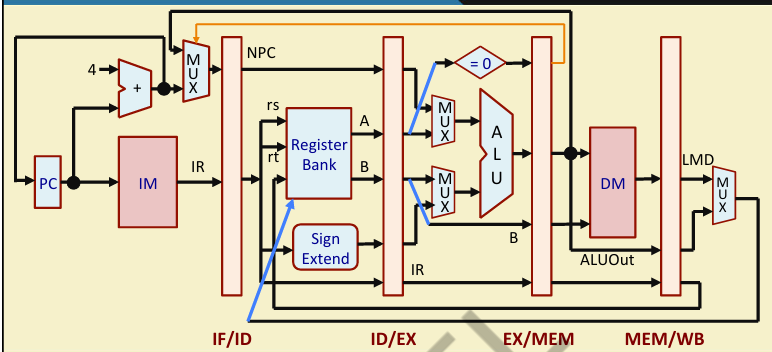

# Pipelined MIPS32 Processor (Verilog)

A 5-stage pipelined MIPS32 processor implemented in Verilog, built around a **2-phase clock scheme** (`clk1`, `clk2`) instead of a single clock — a classic technique (from Harris & Harris / Sudhakar Yalamanchili style textbooks) that keeps writes and reads to the same register file / memory from colliding within one "cycle" without needing separate instruction/data memories.

The design implements the classic 5-stage pipeline:

**IF → ID → EX → MEM → WB**

and includes **data hazard detection with forwarding**, control-flow (branch) handling, and a working test program that runs **bubble sort on an array in data memory** entirely on the processor.

---

## Datapath



The datapath shows the standard 5-stage pipeline registers (`IF/ID`, `ID/EX`, `EX/MEM`, `MEM/WB`), the register bank (`rs`, `rt` reads), sign extension for immediates, the ALU with an equality comparator for branches, and separate access points into data memory (`DM`) and instruction memory (`IM`).

---

## Why a 2-Phase Clock?

Instead of one clock edge doing everything, the design splits work across two non-overlapping clock phases:

| Clock | Stages triggered on this edge |
|-------|-------------------------------|
| `clk1` | IF, EX, WB |
| `clk2` | ID, MEM |

This solves the **structural hazard** on the register file and memory for free:

- The register file is **read** during ID (on `clk2`) and **written** during WB (on `clk1`) — different edges, so no read/write conflict in the same instant.
- A single unified memory (`Mem`) is used for both instructions and data, since instruction fetch (`IF`, on `clk1`) and data memory access (`MEM` stage, on `clk2`) never happen on the same edge. No need for separate I-Mem and D-Mem.

---

## Instruction Set

14 instructions across 5 instruction-format classes:

| Opcode (bin) | Mnemonic | Type | Description |
|---|---|---|---|
| `000000` | ADD | RR-ALU | Register-register addition |
| `000001` | SUB | RR-ALU | Register-register subtraction |
| `000010` | AND | RR-ALU | Bitwise AND |
| `000011` | OR | RR-ALU | Bitwise OR |
| `000100` | SLT | RR-ALU | Set less than |
| `000101` | MUL | RR-ALU | Multiplication |
| `001000` | LW | LOAD | Load word from memory |
| `001001` | SW | STORE | Store word to memory |
| `001010` | ADDI | RM-ALU | Add immediate |
| `001011` | SUBI | RM-ALU | Subtract immediate |
| `001100` | SLTI | RM-ALU | Set less than immediate |
| `001101` | BNEQZ | BRANCH | Branch if not equal to zero |
| `001110` | BEQZ | BRANCH | Branch if equal to zero |
| `111111` | HLT | HALT | Halt the processor |

Instructions are internally classified using a 3-bit `type` field (`RR_ALU`, `RM_ALU`, `LOAD`, `STORE`, `BRANCH`, `HALT`) that's carried down the pipeline alongside the instruction word, so each stage knows how to interpret it.

---

## Hazard Handling

### Structural Hazard
As explained above, the register file and unified memory are each accessed by exactly one stage per clock phase (`clk1` or `clk2`), and no two stages that touch the same resource share an edge. The 2-phase clock removes this hazard by design — no stalling logic needed.

### Data Hazard (RAW) — Forwarding
Because the pipeline computes results in EX (`EX_MEM_ALUOut`) one stage before the value is normally available from the register file, a following instruction reading that same register in ID would otherwise read a stale value. This is solved with **EX → ID forwarding**, checked while reading `rs`/`rt` in the ID stage:

```verilog
// Check if an R-Type instruction in EX is writing to our 'rt' register
if ((EX_MEM_type == RR_ALU) && (EX_MEM_IR[15:11] != 0) && (EX_MEM_IR[15:11] == IF_ID_IR[20:16])) begin
    ID_EX_B <= #2 EX_MEM_ALUOut;
end
// Check if an I-Type instruction (like ADDI) in EX is writing to our 'rt' register
else if ((EX_MEM_type == RM_ALU) && (EX_MEM_IR[20:16] != 0) && (EX_MEM_IR[20:16] == IF_ID_IR[20:16])) begin
    ID_EX_B <= #2 EX_MEM_ALUOut;
end
```

The same pattern is mirrored for the `rs`/`ID_EX_A` operand, checking against `EX_MEM_IR[15:11]` (R-type destination) and `EX_MEM_IR[20:16]` (I-type destination). Register `R0` is explicitly excluded from forwarding since it's hardwired to zero.

### Control Hazard (Branches)
On a taken branch (`BEQZ`/`BNEQZ` resolved in EX/MEM), the IF stage redirects `PC` to the branch target and sets a `TAKEN_BRANCH` flag. This flag suppresses the memory write (`SW`) and register write-back (`WB`) for the instruction(s) already in the pipeline behind the branch, effectively squashing them so incorrect side effects don't get committed.

This is currently a simple **"assume not taken, squash on taken"** approach — see Future Improvements below for smarter branch handling.

---

## Test Program: Bubble Sort in Hardware

The included testbench (`test_mips.v`) loads a 4-element unsorted array into data memory and a hand-assembled bubble sort program into instruction memory, then lets the processor run it to completion.

**Array before:** `[88, 42, 95, 12]`

The assembled program (addresses `0`–`23`) implements a classic nested-loop bubble sort:
- Outer loop counter in `R4`, inner loop counter in `R5`
- `R10`/`R11` hold the base address / current pointer into the array
- Each inner iteration loads two adjacent elements (`LW`), compares them (`SLT`), conditionally swaps via `SW`, and advances the pointer
- `BEQZ`/`BNEQZ` instructions handle loop exit and looping back
- Ends in `HLT`

Run the testbench (e.g. in Vivado, ModelSim, or Icarus Verilog) and check the console output:
BEFORE: [88, 42, 95, 12]
AFTER: [12, 42, 88, 95]

---
## Future Improvements

- **Behavioral → structural refactor**: split this behavioral, monolithic design into a proper **datapath + controller** architecture (separate control unit generating control signals, explicit muxes/ALU as structural modules), closer to how it'd be built in a real RTL/tapeout flow.
- **Expand the ISA**: add more instructions (e.g. `NOR`, `XOR`, shifts, jump-and-link `JAL`/`JR` for function calls, immediate loads like `LUI`).
- **Smarter control hazard handling**: replace the current "squash on taken branch" approach with a **2-bit or 3-bit branch predictor** (e.g. saturating counter / branch history table) to reduce pipeline bubbles on taken branches.
- **Load-use hazard detection**: add a hazard-detect + stall unit for the case where an instruction immediately after a `LW` uses the loaded register (currently relies on the compiler/programmer inserting `NOP`s).
- **Full forwarding paths**: extend forwarding to also cover MEM/WB → EX/ID paths (currently only EX/MEM → ID is implemented) for back-to-back dependent instructions further apart in the pipeline.
- **Memory-mapped I/O** or a simple UART for observing processor output without relying on `$display` in the testbench.

---

## Summary

This project demonstrates a working 5-stage pipelined MIPS32 CPU with hazard-aware design (structural hazard avoided via clocking scheme, data hazards resolved via forwarding, control hazards handled via pipeline squashing), validated by running an actual sorting algorithm on real "hardware" (simulated RTL).
